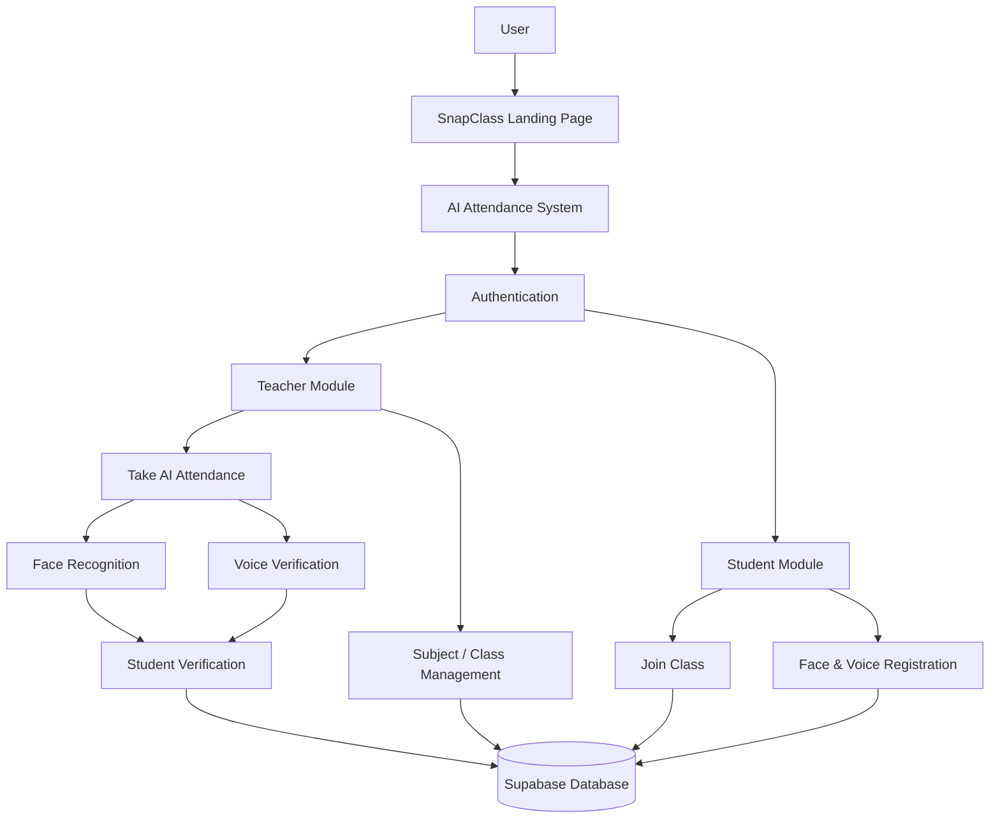

# 📚 SnapClass – AI-Powered Attendance System

**SnapClass** is an AI-powered attendance management system designed to automate the process of recording student attendance using **face recognition and voice biometrics**.

The application provides separate interfaces for teachers and students and uses **Supabase** for cloud-based data management.

## 🌐 Project Links

**Live AI Attendance Application:**  
https://snapclass-attendance-system-taenlekkkjcq93s5mzyr6g.streamlit.app/

**Project Landing Page:**  
https://sc-landing-page-6e66.vercel.app/

**Landing Page Repository:**  
https://github.com/GayatriP1705/sc-landing-page

**AI Attendance System Repository:**  
https://github.com/GayatriP1705/snapclass-attendance-system

---

## ✨ Features

* 👨‍🏫 Teacher module
* 👨‍🎓 Student module
* 🤖 AI-based face recognition attendance
* 🎙️ Voice biometric verification
* 📚 Subject and class management
* 🔗 Class sharing using joining links / QR codes
* ☁️ Supabase cloud database integration
* 📊 Attendance record management
* 🎨 Interactive Streamlit interface

---

## 🛠️ Technologies Used

* **Python** – Core programming language
* **Streamlit** – Application interface
* **OpenCV** – Image and camera processing
* **Dlib / Face Recognition** – Face embedding and recognition
* **Scikit-learn** – Machine learning
* **Supabase** – Cloud database
* **Segno** – QR code generation
* **HTML & CSS** – Interface styling

---

## 📂 Project Structure

Atendence-System-project/
├── .streamlit/
│   ├── config.toml
│   └── secrets.toml
├── src/
│   └── screens/
│       ├── components/
│       │   ├── dialog_add_photo.py
│       │   ├── dialog_attendance_results.py
│       │   ├── dialog_auto_enroll.py
│       │   ├── dialog_create_subject.py
│       │   ├── dialog_enroll.py
│       │   ├── dialog_share_subject.py
│       │   ├── dialog_voice_attendance.py
│       │   ├── header.py
│       │   └── subject_card.py
│       ├── database/
│       ├── pipelines/
│       │   ├── face_pipeline.py
│       │   └── voice_pipeline.py
│       ├── ui/
│       │   └── base_layout.py
│       ├── home_screen.py
│       ├── student_screen.py
│       └── teacher_screen.py
├── .gitignore
├── app.py
└── requirements.txt

---

## ⚙️ Installation

### 1. Clone the repository

```bash
git clone https://github.com/GayatriP1705/snapclass-attendance-system.git
```

### 2. Navigate to the project directory

```bash
cd snapclass-attendance-system
```

### 3. Install dependencies

```bash
pip install -r requirements.txt
```

---

## 🔐 Configuration

SnapClass uses configuration and secret values for services such as Supabase.

Configure the required secrets according to your local development or deployment environment.

> **Important:** Never upload API keys, passwords, database credentials, or other sensitive information to GitHub.

---

## ▶️ Run Locally

Start the Streamlit application with:

```bash
streamlit run app.py
```

The application will open at the local Streamlit URL displayed in the terminal.

---

## ☁️ Deployment

The AI Attendance System is deployed using **Streamlit**.

The project also has a separate landing page deployed using **Vercel**.

The landing page is used to present the project and provide information about its features and technologies, while this repository contains the actual AI attendance application.

---

## 🏗️ Project Architecture



---

## 🌐 Landing Page

A separate frontend landing page has been created to present the SnapClass project, including its overview, features, and technology information.

**Live Landing Page:**
https://sc-landing-page-6e66.vercel.app/

**Source Repository:**
https://github.com/GayatriP1705/sc-landing-page

---

## 🚀 Future Enhancements

* Improve recognition accuracy under different conditions
* Add detailed attendance analytics
* Add downloadable attendance reports
* Improve responsive design
* Enhance authentication and security
* Add more advanced attendance monitoring features

---

⭐ **SnapClass – AI-Powered Attendance System**
